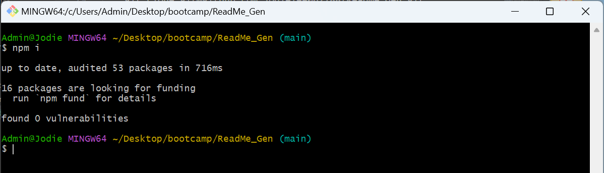
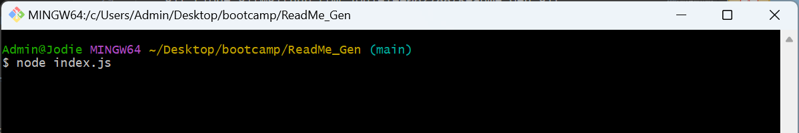
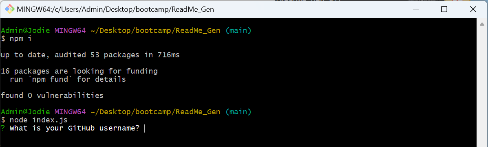

# ReadMe Generator

[](https://opensource.org/licenses/MIT)

## Description
My motivation for creating this README generator was to simplify and streamline the process of generating high-quality README files for my projects. I often found myself spending a significant amount of time writing and formatting READMEs, and I wanted to automate this process to save time and ensure consistency across my projects.

I built this project because I recognized the importance of having a well-documented README for any open-source project. A README serves as the first point of contact for users and potential contributors, providing them with essential information about the project's purpose, usage, and contribution guidelines. By creating a tool that automates the generation of README files, I aim to help developers create professional and informative documentation for their projects effortlessly.

### Problem Solving
This README generator solves the problem of manual README creation, which can be time-consuming and prone to inconsistencies. With this tool, developers can quickly generate comprehensive README files by answering a series of prompts. It streamlines the process and ensures that all essential sections, such as project description, installation instructions, usage guidelines, and licensing information, are included in the generated README.

### Learning
While building this README generator, I learned how to use Node.js and the Inquirer package to create command-line interfaces for user input. I gained a deeper understanding of file system operations in Node.js, such as reading from and writing to files. Additionally, I honed my skills in structuring and organizing README files to convey information effectively. Overall, this project provided valuable experience in automating repetitive tasks and enhancing developer productivity.

## Table of Contents
- [Installation](#installation)
- [Usage](#usage)
- [License](#license)
- [Questions](#questions)
- [How To Contribute](#how-to-contribute)

## Installation
To install and run this project locally, follow these steps:

1. Clone the repository to your local machine.
    
    ```git clone git@github.com:jodielee062788/ReadMe_Gen.git```

2. Open the project folder in your code editor.
3. Explore the code and open index.html in your web browser.

## Usage
To use this repository, follow these steps:

1. Install the dependencies by running:

    ```npm i```
  
    

2. Once the dependencies are installed, you can run the README generator by executing:

    ```node index.js```

    

3. Follow the prompts to input information about your project.

    

4. Here's a walkthrough video on how to run the application [Walkthrough Video](https://drive.google.com/file/d/1MKgTt0opEU1jlNALSlKZF5HioneTUon7/view?usp=sharing).

## License
This project is licensed under the MIT license. See the [LICENSE](./LICENSE) file for details.

## Questions
For any questions or inquiries, please feel free to reach out to me via email at jodielee062788@gmail.com. 
You can also find me on GitHub: [jodielee062788](https://github.com/jodielee062788)
  
## How To Contribute
If you'd like to contribute to this project, please follow these guidelines:
1. Fork the repository to your GitHub account.
2. Clone the forked repository to your local machine.
3. Create a new branch for your feature or bug fix.
4. Make your changes and commit them with descriptive commit messages.
5. Submit a pull request.
